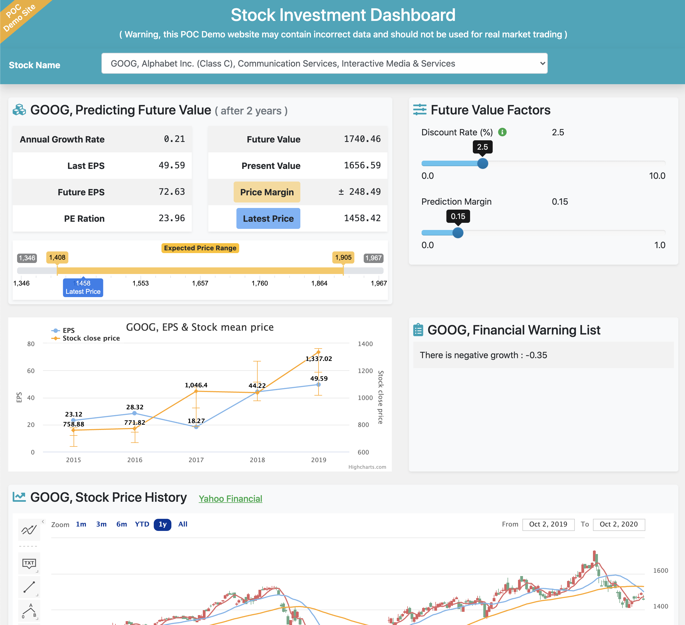
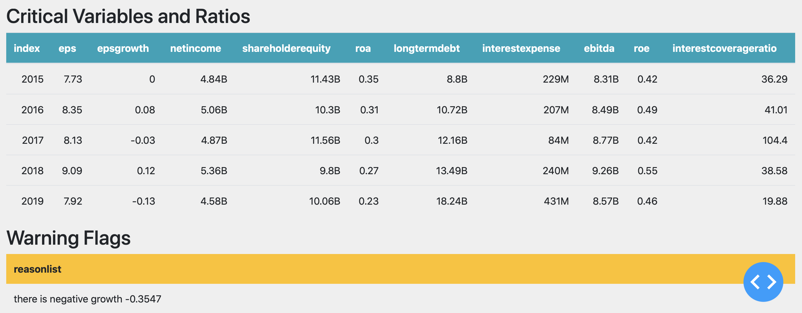

## Stock Investment Dashboard, using python 
---

### Go to [ demo site ](https://stock-dashboard-c2s6b2cyea-de.a.run.app)

### Purpose and Idea

This project is originally for practice purpose , in order to learn how to build web application in Python way after finished some Deep Learning courses with Jupyter Notebook. 
I found Vincent's blog about using python to build investment tool which could analyze and predict stock's reasonable price based on predicted future value. I am interest in investment. I start to work on 1st version , mainly reference to  Vincent's project. 
( You can go to [Vincent Tatan's blog and GitHub project ](https://towardsdatascience.com/value-investing-dashboard-with-python-beautiful-soup-and-dash-python-43002f6a97ca) to get more information. )
 
Then I start to change the framework , redesign  UI , improve performance,  try to make the application looks like a real tool for investor.  You can go to [ demo site ](https://stock-dashboard-c2s6b2cyea-de.a.run.app) to try it out.

This application implement very simplified model to predict expected stock price. 
1. Annual_growth
   - npf.rate(4, 0 , - 1st_year_eps , 5th_year_eps ) , npf is numpy financial package 
2. PE Ratio
   - yearly mean stock price /  EPS , and select minimum of recent 5 year
3. EPS after 2 years later , Future EPS
   - npf.fv( Annual_growth, 2 years , 0, 5th_year_eps)
4. Future Value
   -  Future EPS x PR Ratio
5. Present Value 
   -  npf.pv( Dicount Rate , 2 years, 0, Future Value)
6. Expected Reasonable Price Range , add on +/- margin rate 
   -  Present Value x ( 1  (+/-) Margin Rate )
  
If you try out at demo site, you'll find most price prediction are very different from real market behavior. These business rules are obviously not enough. 

~ ~ ~ So, don't use this application in real market decision ! ! ! ~ ~ ~

Some experts have already developed models and software to solve financial market challenges, like the true story introduced in this book ["The Man Who Solved the Market"](https://www.amazon.com/Man-Who-Solved-Market-Revolution/dp/073521798X). Though that book touch lightly on tech details, may still get some ideas to follow .

---
## Warning : ##
This application has not been rigorously tested and its domain rules are very simple which are hard to cover the complexity of real stock market. There may be also incorrect data introduced by some not found bugs or data sources .
### This application is not mature enough and risky to be your decision tool in real stock market !

-------

### Screenshots : 

-------

### Develop tools and main packages  
1. Visual Studio Code
2. Python 3.8
3. pipenv
4. Web framework :  from Dash migrate to Django
5. Django Rest Framework
6. Stock chart :  from cufflinks.quant_figure change to HighCharts Stock
7. jQuery : through ajax update information and stock chart
8. pandas datareader : to get stock price histor 
9. BeautifulSoup : parsing web page
10. gunicorn web server
11. dj-static for static file process in gunicorn 
12. Web UI apply Bootstrap 4.x and responsive
13. Fontawesome : icon
14. bootstrap-slider :  https://github.com/seiyria/bootstrap-slider
15. Ion.RangeSlider : http://ionden.com/a/plugins/ion.rangeSlider/index.html
    

## Run and Deploy
1. no requirement for database or storage
2. stock price and financial information are real time access from other web site or service , if data source web sites block request that will cause service error
3. Stock information will be cached in memory for 12 hr after first accessed
4. Demo site is deploy to Google Cloud Run, it may need more seconds to start application if it already auto shutdown after long idle. 
5. It may take more seconds to refresh stock information if it's the first usage of that stock in last 12 hours

 
### Run in development mode
1.  python manage.py runserver
  
### Run in gunicorn
1. python manage.py collectstatic  // this will copy css js image ... files to staticfiles folder
2. gunicorn --bind 0.0,0.0:change_to_prefered_port config.wsgi:application
   
### Deploy to Google Cloud Run
1. Apply Google Cloud Service account
2. install Google Cloud SDK for python, follow instruction on official document
3. install Google Cloud extend module for Visual Code
4. use Cloud Run to deploy application

### Run in Jupyter Notebook
1. In Jupyter Notebook, use jupyter-dash to wrap application and run in new browser. Need to install jupyter-dash to run.
2. dashboard.py is the app called in Jupyter notebook, it's 2nd version based on Dash

