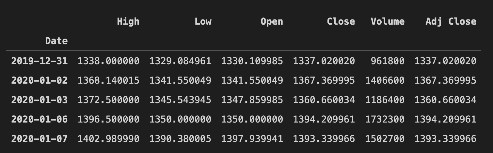

## Simple Value Investing Dashboard, using python 

This application , refer [Vincent Tatan's blog and project at GitHub ](https://towardsdatascience.com/value-investing-dashboard-with-python-beautiful-soup-and-dash-python-43002f6a97ca) , collect company's stock price history , financial summary information from professional financial website ( MarketWatch) and yahoo ( pandas' datareader) to do simple rule-based analysis and infer reasonable share price then give user a hint about sell or buy decision .

Value investment and technical analysis are two mainstream in stock market. To increase probability of winning , investors now should know more than that in this rapid change era . Maybe buy good funds is better idea for general investors.  Even professional fund managers face big challenge in collecting and interpreting information to make good decision , as soon as possible , in investment portfolio and when to buy or sell share . 

It's fun to develop application for investment activities. 

Python has lots of packages for data processing and visualization, it is easy to use too.  Thanks Vincent share his idea and project , I have learn a lot.  

Following are some changes I make from that project :
- Change UI layout and apply Bootstrap 4
- Could execute in Jupyter notebook
- File name are also changed and do some code refactoring
- Get data through API from stock market data company is more reliable and efficient than parsing web page from website , but this part left no modification.

.


It's great to design a system could auto collect and read information then give user more accurate suggestion of portfolio and market timing. Such system should already exist.  Big Data and AI technology will make them more powerful.  Join such project will be fun !

.

## Warning : ##
This application has not been rigorously tested and its domain rules are very simple which are hard to cover the complexity of real stock market. There may be also wrong information introduced by some not found some bugs.
## <span style='color:#a00000'>This application is not mature enough and risky to be your decision tool in real stock market !</span>


-------

### Screenshots : 


Main process :
1. Get stock ticker and name to be data source of dropdown control
2. Get stock price history from yahoo through pandas datareader when user choose a stock from dropdown control
3. Plot stock k chart , sma  , macd , rsi lines
4. Get stock financial information from financial website to do basic analysis and infer future value for trading decision.

Stock data sample from yahoo:


### Parsing fincial information from MarketWatch web site
For example, to get Google's financial information from this url : https://www.marketwatch.com/investing/stock/GOOG/financials

### Warning Signs List based on value investing logic ###

Given list of the companies, find out the feasibility to invest

1. Been in market minimal 10 years
1. Have the track records (EPS per year)
1. Have efficiency (ROE > 15%) — Net income / shareholder equity
1. Determine manipulation (ROA > 7%) — Net income / Total Asset
1. Have small long term debt (Long term debt <5* total income)
1. Low Debt to Equity
1. Ability to pay interest: (Interest Coverage Ratio >3) — EBIT / Interest expenses

### Decision rules for stock transaction

Decision making from each company in terms of return rate given the value investing methodology :

1. Find EPS Annual Compounded Growth Rate
2. Estimate EPS 10 years from now
3. Estimate stock price 10 years from now (Stock Price EPS * Average PE)
4. Determine target by price today based on returns(discount rate 15%/20%)
   - Discount rate indicated predicted inflation over the period of 5 years. 
5. Add margin of safety (Safety net 15%)
   - Margin calculation rate is the toleration for error. You add on additional safety net in the case of calculation error. The more the margin calculation rate, the more risk averse you are or vice versa.
6. Buy if market price is lower than the marginal price
7. Sell if market price is higher than the marginal price


Package list:
- Beautiful Soup as the Web Scraping Tool
- Pandas data-reader API to get the financial stocks price
- Flask/Dash for Web Application Framework (not used in jupyter notebook mode)
- ipywidgets for interactive widgets in jupyter notebook , follow [Semi Koen's ](https://towardsdatascience.com/bring-your-jupyter-notebook-to-life-with-interactive-widgets-bc12e03f0916) and [Will Koehrsen's](https://towardsdatascience.com/interactive-controls-for-jupyter-notebooks-f5c94829aee6) blogs at Medium


Install follow packages to start using Dash :
- The core dash backend.
- Dash front-end
- Dash HTML components
- Dash core components
- Plotly

```
    !pip install dash
    !pip install dash-renderer
    !pip install dash-html-components
    !pip install dash-core-components
    !pip install plotly
```